# Pig Game Project
[Live webpage](https://pig-game-project-426f7f2476af.herokuapp.com/)

Developer : Mattias Lundkvist

## project overview


## Subject 
Made a simple dice game,that you can play when you are bored.

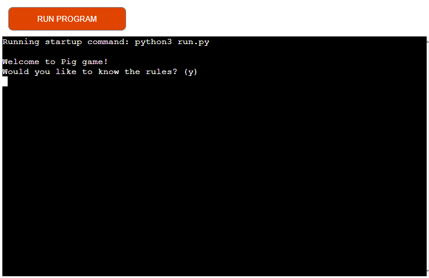


## Table of contents


1. [Project Goal](#project-goal)
2. [User Experience](#user-experience)
    1. [User Requirements and Expectations](#user-requirements-and-expectations)
    2. [User Stories](#user-stories)
3. [Technologies Used](#technologies-used)
    1. [Languages](#languages)
    2. [Tools](#tools)
4. [Features](#features)
5. [Testing](#testing)
    1. [User stories testing](#user-stories-testing)
7. [Bugs](#bugs)    
8. [Deployment](#deployment)
9. [Credits](#credits)
10. [Acknowledgements](#acknowledgements)


## Project goal

The goal of the project was to create a simple app. Which you could play in single play agains the computer,
or together with a few friends

## User Experience

- For someone who is looking to spend a few minutes doing something that requires no deep thinking

### User requirements and expectations

- A easy understandable game
- Game doesn't take to long to play
- Can be enjoyed alone or with friends


### User Stories

### First-Time Users


1. As a first-time user, I would like to have a simple explanation of the rules

2. As a first-time user, I would like to enjoy a short game alone

3. As a first-time user, I would like to enjoy a short game with friends

4. As a first-time user, I would like to keep track of my score easily

5. As a first-time user, I would like to be able to restart a game when the current game is finished


## Features


#### Rule Explanation

When you open the game there will be a choice to show the rules of the game 


#### Number of Players

User will be asked how many players will be playing


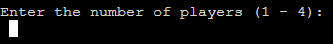


#### 'Dice' rolls

A random number function generates a number between 1 and 6

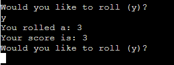


#### Play again

After a winner is decided, user will be asked if they want to play again.
'y' will start a new game 'n' will exit program


#### 1 Player game

User is given a oppurtunity to play against the computer in a 1 player game

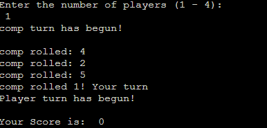

#### Multiplayer game

Up to 4 users can play against eachother

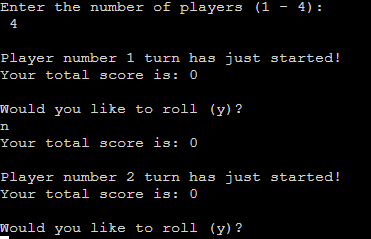

 
## Technologies used :

### Languages

- Python

### Tools

- Github
- Gitpod
- Ci Python Linter

## Testing

Ran the code through the Ci Python Linter.
Also played through the game multiple times


## Ci Python Linter

Returns two warnings of the following: E225 missing whitespace around operator.
Although the lines referred to clearly has whitespaces


## User stories testing

### First time users

1.  As a first-time user, I would like to have a simple explanation of the rules

| **Feature** | **Action** | **Expected Result** | **Actual Result** |
|-------------|------------|---------------------|-------------------|
| Rule Explanation| Press "Y" when asked by the program| Displays rules| Works as expected |


<details><summary></summary>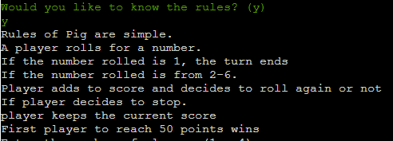</details>

2. As a first-time user, I would like to enjoy a short game alone

| **Feature** | **Action** | **Expected Result** | **Actual Result** |
|-------------|------------|---------------------|-------------------|
| 1 Player game| Press "1" when program asks for how many players|Starts game against computer| Works as expected |

<details><summary></summary>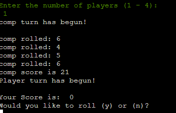</details>

3. As a first-time user, I would like to enjoy a short game with friends

| **Feature** | **Action** | **Expected Result** | **Actual Result** |
|-------------|------------|---------------------|-------------------|
|Multiplayer game| Press 2-4 when program asks for how many players| Starts game with selected number of players| Works as expected |


<details><summary></summary>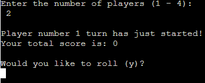</details>


4. As a first-time user, I would like to keep track of my score easily


| **Feature** | **Action** | **Expected Result** | **Actual Result** |
|-------------|------------|---------------------|-------------------|
|1 Player game, Multiplayer game, 'Dice' rolls | Press "Y" when game asks to roll|Game lets you know your score after die i rolled | Works as expected |

<details><summary></summary>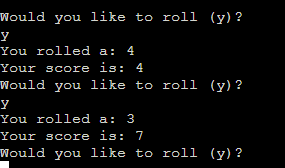</details>

5. As a first-time user, I would like to be able to restart a game when the current game is finished

| **Feature** | **Action** | **Expected Result** | **Actual Result** |
|-------------|------------|---------------------|-------------------|
| Play again| Press "Y" when game asks you| Restarts game| Works as expected |

<details><summary></summary>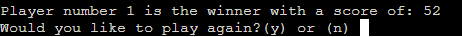</details>


## Bugs

- There are no known bugs in the code.


## Deployment


### Deploying the website in Heroko:

- The application was deployed to Heroko using following steps:

#### Login or create an account at Heroku

- Make an account in Heroko and login

<details>
    <summary>Heroko Login Page</summary>
    
</details>

#### Creating an app

  - Create new app in the top right of the screen and add an app name.
  - Select region
  - Then click "create app".

<details>
    <summary>Create App</summary>
    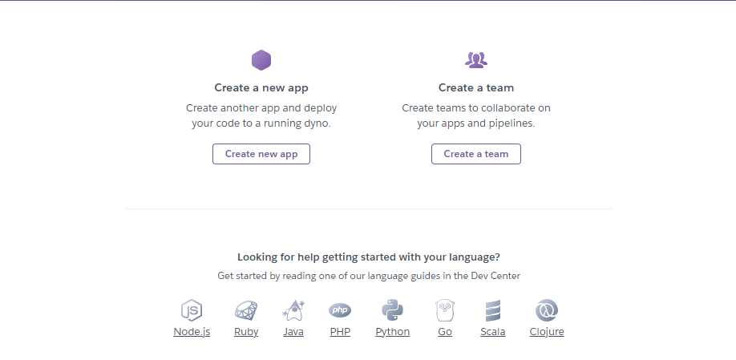
</details>

#### Open settings Tab

  ##### Click on config var

  - Store PORT in key and value

<details>
    <summary>Config var</summary>
    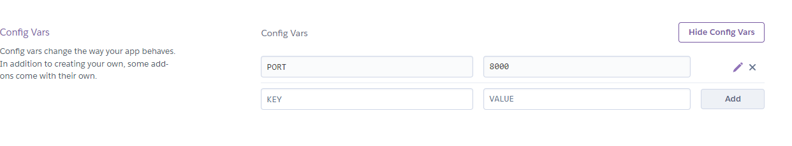
</details>

  ##### Add Buildpacks

  - Add python buildpack first
  - Add Nodejs buildpack after that

<details>
    <summary>Buildpacks</summary>
    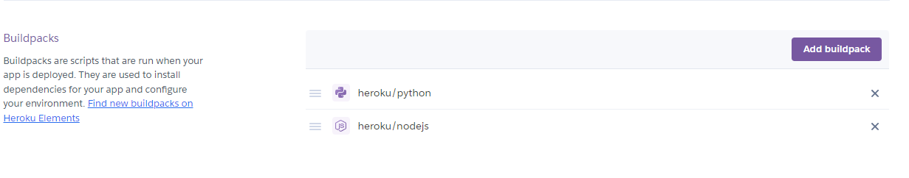
</details>

 #### Open Deploy Tab

   ##### Choose deployment method

  - Connect GITHUB
  - Login if prompted

<details>
    <summary>Deployment method</summary>
    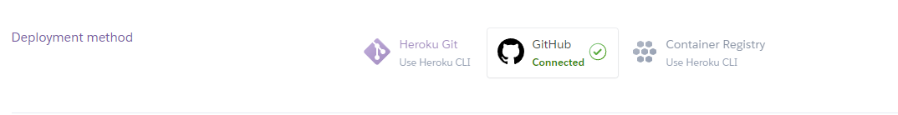
</details>

   ##### Connect to Github

  - Choose repositories you want to connect
  - Click "Connect"

<details>
    <summary> Repo Connect</summary>
    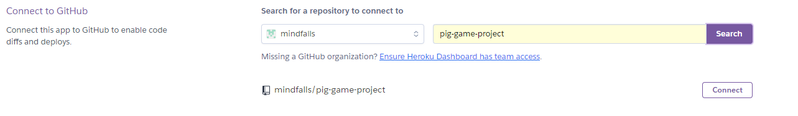
</details>

  ##### Automatic and Manual deploy

  - Choose a method to deploy
  - After Deploy is clicked it will install various file

<details>
    <summary> Deploy methods</summary>
    
</details>

  ##### Final Deployment

  - A view button will display
  - Once clicked the website will open

<details>
    <summary> Deploy</summary>
    
</details>

### Forking the GitHub Repository
1. Go to the GitHub repository
2. Click on Fork button in top right corner
3. You will then have a copy of the repository in your own GitHub account.
4. [GitHub Repository](https://github.com/mindfalls/pig-game-project)

### Cloning the repository in GitHub
1. Visit the GitHub page of the website's repository
2. Click the “Clone” button on top of the page
3. Click on “HTTPS”
4. Click on the copy button next to the link to copy it
5. Open your IDE
6. Type ```git clone <copied URL>``` into the terminal


## Credits


### Code

The following tutorial was used as a guide for the application:

[Tech with tim](https://www.youtube.com/watch?v=21FnnGKSRZo)

